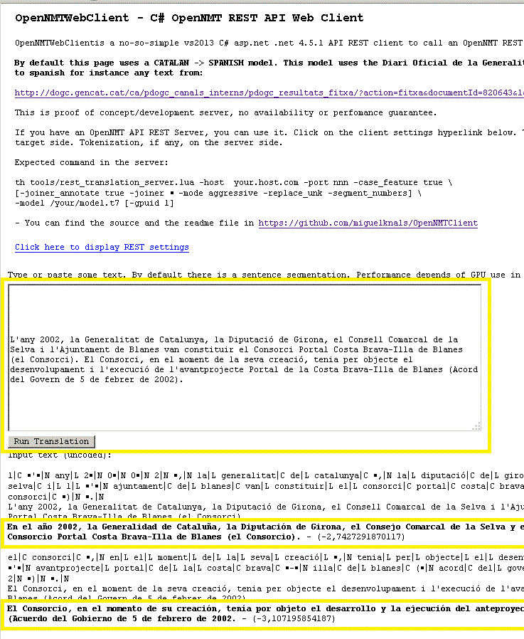

# 1 OpenNMTClient - OpenNMT C# REST API Client   

OpenNMT is a open source code for Neuronal Machine Translation ([http://opennmt.net/](http://opennmt.net/)). OpenNMT provides a REST API server for a translation based in model.

This repository has a C# Visual Studio 2013 Net 4.5.1 solution in order send and receive JSON calls to the OpenNMT API REST server for the translation process.

The solution includes 2 clients/projects. Both of them share a common code in order to call the API REST Server. These clients are:

- OpenNMTWebClient a C# ASP.Net web page.
- OpentNMTConsoleClient a C# Console Program

In order to run the samples you need to connect to OpenNMT REST API server.


## 1.2 OpenNMTWebClient

Not sure for how long, but you can find a online deployment of this solution in:

<a href="http://213.97.57.158/OpenNMTWebClient/ONMTSimpleRESTWebClient.aspx" target="_blank">http://213.97.57.158/OpenNMTWebClient/ONMTSimpleRESTWebClient.aspx</a>

There is a text box where you can paste some text. The program provides by default and optional segmentation (otherwise you must specify one sentence per line).

 Once you click "Run Translation", your input is segmented, and REST calls created to the REST Server. Server should be reachable by the web page.

**If you have an accessible OpenNMT REST API server, you can use it** 

You also can display more detailed info from the JSON response.

Typical output:

 

### 1.2.1 OpenNMT REST API Server

If you provide a server:

- OpenNMT server (rest_translation_server.lua). **The code expects a case feature mode in the target side. Tokenization, if any, on the server side.**
- The expected command:  

```
th tools/rest_translation_server.lua -host your.host.com -port nnn -case_feature true
```
```
[-joiner_annotate true -joiner ￭ -mode aggressive -replace_unk  -segment_numbers]
```
```
-model /your/model.t7 [-gpuid 1]
```  

## 1.3 OpenNMTConsoleClient

The format of the exe file:

```
OpenNMTConsoleClient -h host -p port -f inputfile
```  

This program reads the input file, connects to the `host:port` and translates line by line the input file. **Each line should be a sentence** 

It will create in the same directory 3 files, a bitext pair (`inputfile.src.txt` and `inputfile.tgt.txt`) and the json file (`inputfile.json`)

## 1.4 Very general info about the code

The main core is in RESTClient.cs. This code is shared for the console program and the web page.

- Class RESTClientDataC instance contains all data:
  - Raw sentences (user input) and log/control information 
  - List of SourceONMT classes instances (in order to create the JSON structure for the REST API call)
  - List of List of TargetONMT classes instances (in order to create the JSON structure of REST API response, that is, `n_best, pred_score, src, tgt `)
- Class RESTClient instance for the HttpClient, that uses the previous data class, plus two methods:
  -  RESTClientDataC. Process al raws sentences in one call.
     - Creates the JSON request
     - Calls the REST API server (C# .NET PostAsync)
     - Reads respose 
  - TranslateRESTClientData1by1. Sentences will be processed one by one calling the previous RESTClientDataC call each time.


## 1.5 References

Some help has been provided by reading the Panos Kanavos / Jean Senellart plugin [https://github.com/OpenNMT/Plugins](https://github.com/OpenNMT/Plugins). My ack here!